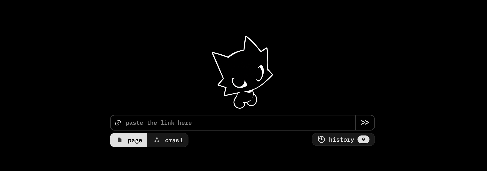

# Xerox

UI-first local website cloner.

Runs locally. Opens a browser UI. Supports:
- `page`
- `crawl`
- live logs
- local history
- discovered links export



## Quick Start

### macOS / Linux

```bash
git clone https://github.com/legitsdev/Xerox.git
cd Xerox
./install.sh
./xerox
```

### Windows PowerShell

```powershell
git clone https://github.com/legitsdev/Xerox.git
cd Xerox
.\install.ps1
.\xerox.ps1
```

### Windows Command Prompt

```bat
git clone https://github.com/legitsdev/Xerox.git
cd Xerox
install.bat
xerox.bat
```

SSH:

```bash
git clone git@github.com:legitsdev/Xerox.git
```

## Modes

- `page`: clone one page and the assets needed to reproduce it locally
- `crawl`: start from one URL, follow internal navigation, and rewrite local links between saved pages

## Install

The installer:
- picks a working Python `3.10+` interpreter
- creates a repo-local `.venv`
- installs dependencies
- installs Playwright Chromium
- runs a smoke check

The launcher:
- starts the local web UI
- uses `127.0.0.1:4173` or the next free port
- runs from the repo-local `.venv` without manual activation

## Commands

Main flow:

```bash
./install.sh
./xerox
```

Secondary entrypoint:

```bash
python -m xerox --no-open
```

Editable install:

```bash
pip install -e .
```

## Local Data

Typical locations:
- macOS: `~/Library/Application Support/xerox`
- Linux: `~/.local/share/xerox`
- Windows: `%APPDATA%\xerox`

Each job stores:
- cloned site files
- `site_report.txt`
- `result.json`
- `job.log`
- `found_links.txt`

## Troubleshooting

### `Python 3.10+ was not found`

Install Python `3.10+` and rerun the installer.

If you want a specific interpreter on macOS/Linux:

```bash
XEROX_PYTHON=/path/to/python3.12 ./install.sh
```

### `Playwright Chromium is not installed`

Rerun the installer.

Manual recovery:

```bash
./.venv/bin/python -m playwright install chromium
```

Windows:

```powershell
.\.venv\Scripts\python.exe -m playwright install chromium
```

### Linux system packages

If Playwright reports missing OS libraries, install the packages it requests and rerun `./install.sh`.

## Notes

- Some sites use anti-bot or challenge pages. They are not guaranteed.
- `crawl` is conservative and does not submit forms or authenticate.

## License

MIT
